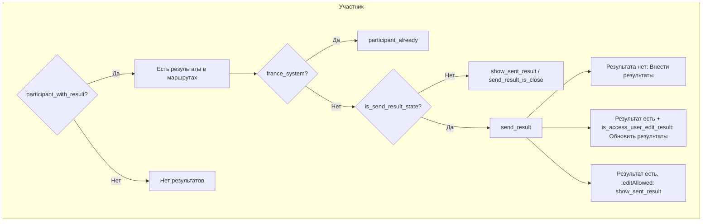

---
name: Welcome Page Button Logic
overview: Документация логики отображения всех кнопок на странице welcome (resources/views/welcome.blade.php) — условия и флаги, при которых каждая кнопка показывается или скрывается.
todos: []
isProject: false
---

# Логика переключения кнопок на странице Welcome (фронт)

Данные для view приходят из [EventShowService::prepareEventData](app/Services/EventShowService.php) и модели [Event](app/Models/Event.php).

---

## Ключевые флаги и переменные


| Флаг/переменная                                       | Источник         | Описание                                                                          |
| ----------------------------------------------------- | ---------------- | --------------------------------------------------------------------------------- |
| `$event->is_finished`                                 | Event            | Соревнование завершено                                                            |
| `$event->is_registration_state`                       | Event            | Регистрация открыта                                                               |
| `$event->is_send_result_state`                        | Event            | Внесение результатов открыто                                                      |
| `$event->is_need_pay_for_reg`                         | Event            | Требуется оплата для регистрации                                                  |
| `$event->is_france_system_qualification`              | Event            | Французская система квалификации (судьи вносят результаты)                        |
| `$event->is_access_user_edit_result`                  | Event            | Пользователь может редактировать результаты                                       |
| `$event->is_access_user_cancel_take_part`             | Event            | Пользователь может отменить регистрацию                                           |
| `$event->is_input_set`                                | Event            | Сеты вводятся вручную (1 = без сетов)                                             |
| `$event->is_group_registration`                       | Event            | Включена групповая регистрация                                                    |
| `$is_fast_reg_available`                              | EventShowService | FeatureFlag FAST_REG **и** категории MANUAL или AUTO_CATEGORIES_RESULT            |
| `$is_show_button_list_pending`                        | EventShowService | Есть занятые сеты, и для возрастных категорий — возраст подходит под занятые сеты |
| `$is_show_button_fill_results_to_route`               | EventShowService | Участник + уже есть результаты в маршрутах                                        |
| `$is_show_button_qualification_classic_results`       | EventShowService | Есть записи в result_qualification_classic                                        |
| `$is_show_button_qualification_france_system_results` | EventShowService | Есть записи в result_route_france_system_qualification                            |
| `$is_show_button_semifinal`                           | EventShowService | Есть результаты полуфинала                                                        |
| `$is_show_button_final`                               | EventShowService | Есть результаты финала                                                            |
| `$show_group_registration_dev`                        | EventShowService | `app.env` = dev или local                                                         |


---

## 1. Неавторизованные пользователи (@guest)

```mermaid
flowchart TD
    subgraph guest [@guest]
        A{is_finished?}
        A -->|Да| eventClose[event-close: Соревнование завершено]
        A -->|Нет| B{is_registration_state?}
        B -->|Да| C[Войти + опционально Быстрая регистрация]
        B -->|Нет| regClose[reg-close: Регистрация закрыта]
        C --> D{is_fast_reg_available?}
        D -->|Да| fastReg[Быстрая регистрация]
        D -->|Нет| onlyLogin[Только Войти]
    end
```


- **Если `is_finished`**: показывается только `event-close` (Соревнование завершено).
- **Если `!is_finished` и `is_registration_state`**: блок с "Войти" + при `$is_fast_reg_available` — "Быстрая регистрация".
- **Если `!is_finished` и `!is_registration_state`**: показывается `reg-close` (Регистрация закрыта).
- **Быстрая регистрация** только при:
  - `FeatureFlag::isEnabled(FAST_REG)`
  - и `is_auto_categories` ∈ {MANUAL_CATEGORIES, AUTO_CATEGORIES_RESULT}

---

## 2. Авторизованные пользователи (@auth)

### 2.1 Блокирующие проверки (без этих условий кнопки не показываются)

- **Нет валидного email**: всегда кнопка «Заполните ваш Email в профиле».
- **Нет русских имени/фамилии (isRussianOnly)**: предупреждение + «Перейти в профиль».
- **Нет даты рождения** при `is_input_birthday`: предупреждение + «Перейти в профиль».
- **Нет контакта** при `is_need_pay_for_reg`: предупреждение + «Перейти в профиль».
- **Соревнование завершено (`is_finished`)**: `event-close` + при `$is_show_button_fill_results_to_route` — `show_sent_result`.

### 2.2 Пользователь уже участник (`User::user_participant`)




**Если уже есть результаты в маршрутах (`participant_with_result`):**

- **France system**: только `participant_already`.
- **Обычная система**:
  - При `is_send_result_state` — показываем `send_result`:
    - Результата ещё нет → «Внести результаты».
    - Результат есть + `is_access_user_edit_result` → «Обновить результаты».
  - При `participant_already` и `results_have_been_sent_already` — всегда показываем эти метки.
  - Если результат есть, но нет `is_access_user_edit_result` → `show_sent_result` (Посмотреть результаты), без кнопки внесения.

**Если результатов ещё нет (`!participant_with_result`):**

- **Требуется оплата (`is_need_pay_for_reg`):**
  - Оплата пройдена (`is_pay_participant`):
    - France system → `participant_already`.
    - Иначе → при `is_send_result_state` → `send_result`.
  - Оплата не пройдена:
    - При `is_registration_state` → `cancel_take_part` + `take_part`.
- **Без оплаты:**
  - France system → `cancel_take_part` + `participant_already`.
  - Иначе:
    - При `is_send_result_state` → `send_result`.
    - Иначе → `send_result_is_close`.
    - При `is_registration_state` → дополнительно `cancel_take_part`.

Во всех ветках участника — `documents` (если `required_documents`).

### 2.3 Пользователь не участник (хочет зарегистрироваться)

Показываются селекты (категория, пол, сет и т.д.) + кнопки:

- При `is_registration_state` → `take_part`, при `$is_show_button_list_pending` → `list_pending`.
- При `!is_registration_state` → `reg-close`.

### 2.4 Групповая регистрация

- При `is_registration_state && is_group_registration` → `take_part_group`.
- Или при `$show_group_registration_dev` (dev/local) → `take_part_group` с пометкой «только для dev и local».

### 2.5 Дополнительные кнопки (всегда видны при выполнении условий)


| Кнопка                             | Условие                                                                                                                        |
| ---------------------------------- | ------------------------------------------------------------------------------------------------------------------------------ |
| Лист ожидания                      | `ListOfPendingParticipant::has_in_list_pending_event($event)`                                                                  |
| Список участников                  | Всегда                                                                                                                         |
| Результаты квалификации (классика) | `!is_france_system_qualification && $is_show_button_qualification_classic_results && !$event->hide_qualification_results`      |
| Совмещённые результаты             | То же + `$event->is_open_main_rating`                                                                                          |
| Результаты квалификации (France)   | `is_france_system_qualification && $is_show_button_qualification_france_system_results && !$event->hide_qualification_results` |
| Результаты полуфинала              | `$event->is_semifinal && $is_show_button_semifinal`                                                                            |
| Результаты финала                  | `$is_show_button_final`                                                                                                        |
| Отправить результаты на email      | `!is_send_result_state && is_open_send_result_state && rules_calculate != POINT_PER_MOVE`                                      |
| Статистика                         | `!is_send_result_state && is_open_public_analytics`                                                                            |


---

## 3. Краткая таблица: кнопки и условия


| Кнопка                                         | Условие показа                                                                                                    |
| ---------------------------------------------- | ----------------------------------------------------------------------------------------------------------------- |
| **reg-close** (Регистрация закрыта)            | `!is_registration_state` и событие не завершено                                                                   |
| **event-close** (Соревнование завершено)       | `is_finished`                                                                                                     |
| **Быстрая регистрация**                        | @guest + `is_registration_state` + `$is_fast_reg_available`                                                       |
| **take_part** (Зарегистрироваться/Участвовать) | @auth + не участник + `is_registration_state` + профиль заполнен                                                  |
| **cancel_take_part**                           | @auth + участник + `is_access_user_cancel_take_part` + нет bill (для оплаты) + нет результата (после внесения — никогда) + `is_registration_state` или France |
| **list_pending**                               | @auth + не участник + `$is_show_button_list_pending` + `is_registration_state` + `!is_input_set`                  |
| **send_result**                                | @auth + участник + `is_send_result_state` + (нет результата → «Внести»; результат + `is_access_user_edit_result` → «Обновить») |
| **show_sent_result**                           | @auth + (`is_finished` и `$is_show_button_fill_results_to_route`) или участник без права редактирования           |
| **send_result_is_close**                       | @auth + участник + нет результатов + `!is_send_result_state`                                                      |
| **participant_already**                        | @auth + участник (France или уже есть результаты)                                                                 |
| **results_have_been_sent_already**             | @auth + участник + есть результаты в маршрутах                                                                    |
| **documents**                                  | @auth + участник + `required_documents` не пустой                                                                 |
| **take_part_group**                            | @auth + (`is_registration_state && is_group_registration`) или `$show_group_registration_dev`                     |


---

## 4. Тестирование логики

Логика кнопок вынесена в `lib/utils/competition_detail_button_logic.dart` и покрыта unit-тестами:

```bash
flutter test test/unit/utils/competition_detail_button_logic_test.dart
```

Тесты проверяют: `canShowResultButton`, `resultButtonCanEdit`, `canShowCancelRegistrationButton`, `isPaymentConfirmed`.

---

## 5. Специфика partial-кнопок

- **cancel_take_part**: `!has_bill` + `!is_participant_paid` + `!resultExists`. После внесения результатов — никогда не показывается. Единая логика в welcome и Flutter.
- **take_part**: текст и состояние берутся из `ButtonTakePartStatus` (оплата, свободные сеты, таймер и т.д.).
- **list_pending**: в модалке — проверки по `validSets` и возрасту (для AUTO_CATEGORIES_YEAR/AGE).
- **documents**: внутри partial проверяются `hasValidDocuments` и `has_documents`.

---

## 6. Сравнение: welcome (backend) и Flutter-приложение

| Аспект | Welcome (Blade) | Flutter |
|--------|-----------------|---------|
| Кнопка результатов | Совпадает | `CompetitionDetailButtonLogic.canShowResultButton` + `ResultEntryButton._canEdit` |
| Кнопка отмены | `is_access_user_cancel_take_part && !has_bill` | `canShowCancelRegistrationButton`: `!has_bill && !is_participant_paid && !resultExists` (has_bill из checkout API) |
| Лист ожидания | Только при `!is_input_set` | Только при `is_input_set == 0` |
| Блокировка по возрасту | Только при `!is_input_set` | Только при `is_input_set == 0` |
| `is_input_set` | 0 = сеты, 1 = без | 0 = сеты, 1 = без |

### Кнопка отмены — единая логика

Оба используют:
- `is_access_user_cancel_take_part == 1`
- `!has_bill` — после прикрепления чека отмена невозможна
- `!is_participant_paid` — после подтверждения оплаты отмена невозможна  
- `!resultExists` — после внесения результатов отмена невозможна никогда

Flutter получает `has_bill` из `/api/event/{id}/checkout` (при платном событии и неоплаченной регистрации).

---

## Диаграмма общей структуры (auth)

```mermaid
flowchart TD
    subgraph auth [@auth]
        validEmail{valid_email?}
        validEmail -->|Нет| fillEmail[Заполните Email]
        validEmail -->|Да| russianNames{isRussianOnly?}
        russianNames -->|Нет| fillProfile[Перейти в профиль]
        russianNames -->|Да| finished{is_finished?}
        finished -->|Да| eventClose2[event-close + show_sent_result если нужно]
        finished -->|Нет| isParticipant{user_participant?}
        isParticipant -->|Да| participantBranch[Ветка участника]
        isParticipant -->|Нет| nonParticipantBranch[Ветка не участника]
        participantBranch --> regState1{is_registration_state?}
        nonParticipantBranch --> regState2{is_registration_state?}
        regState1 -->|Да| takePartOrCancel[take_part / cancel_take_part и др.]
        regState1 -->|Нет| regClose2[reg-close]
        regState2 -->|Да| takePart[take_part]
        regState2 -->|Нет| regClose3[reg-close]
    end
```


